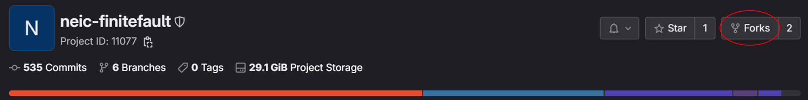
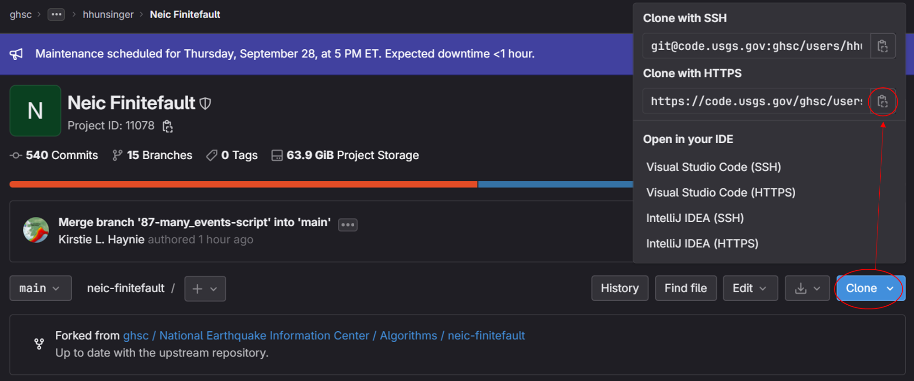
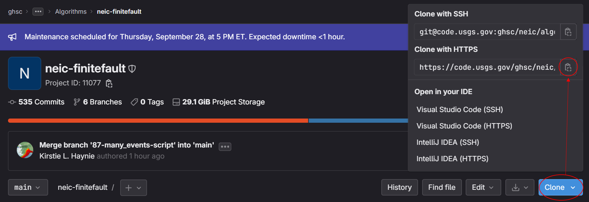
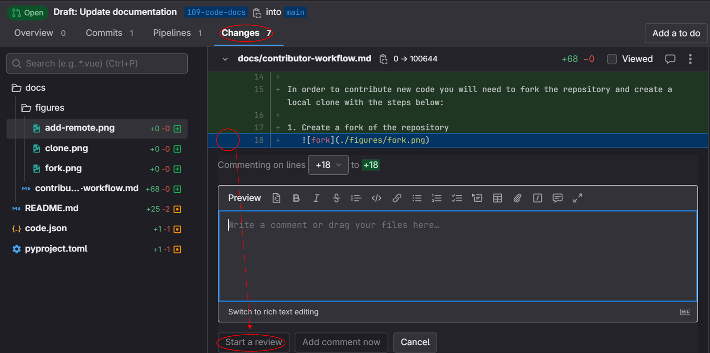
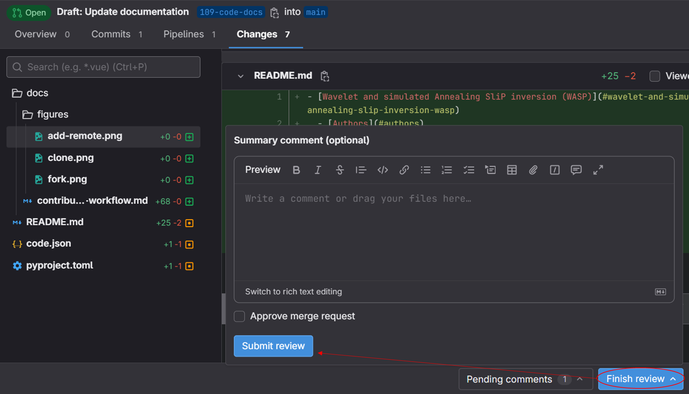

# Contributor Workflow

The information in this document outlines how to contribute to this project.

- [Contributor Workflow](#contributor-workflow)
  - [Forking the Repository](#forking-the-repository)
  - [Getting Updates from the Upstream Repository](#getting-updates-from-the-upstream-repository)
  - [Contributing Changes as an Issue](#contributing-changes-as-an-issue)
  - [Reviewing a Merge Request](#reviewing-a-merge-request)
  - [Creating/Addressing Comments](#creatingaddressing-comments)
    - [Reviewer Role: Starting an Initial Review](#reviewer-role-starting-an-initial-review)
    - [Developer Role: Submitting a Response Review](#developer-role-submitting-a-response-review)

## Forking the Repository

In order to contribute new code you will need to fork the repository and create a local clone with the steps below:

1. Create a fork of the repository
   
2. Create a local clone of your fork
   1. Copy the clone url from your fork
      
   2. Clone locally with the command: `git clone <clone url>`
3. Add the upstream remote
   1. Copy the clone url from the upstream repository
      
   2. Add the upstream remote with the command: `git remote add upstream <clone url>`

## Getting Updates from the Upstream Repository

All development should be performed on a development branch. The default branch (main) should be reserved for receiving updates from the upstream repository. To get updates from the upstream perform the following commands:

1. Get updates to main:
   1. `git checkout main`
   2. `git pull --ff-only upstream main`
   3. `git push origin main` (might require the `--force` flag)
   4. Either check out a new branch (`git checkout -b <new branch name>`) or rebase an existing branch (`git checkout <existing branch>` then `git rebase main`)

## Contributing Changes as an Issue

If an issue has not been created for your change, please submit one, then assign yourself to the issue and perform the following steps:

1. Ensure that the steps [Forking the Repository](#forking-the-repository) and [Getting Updates from the Upstream Repository](#getting-updates-from-the-upstream-repository) have already been performed
2. From the main branch checkout a branch with a name starting with the issue number: `git checkout -b <issue #>-<issue description>`
3. On that branch make changes and commit them
4. Submit a merge request from your branch to the upstream main branch

   1. If your branch name starts with the issue number, the merge request description should automatically say `Closes #<issue #>`. If it does not, add the close statement so that the issue will be closed when the merge is completed.

5. Assign a reviewer to the merge request
6. Address any reviewer comments (See [Creating/Addressing Comments](#creatingaddressing-comments))

## Reviewing a Merge Request

If you have been assigned (or have assigned yourself) as a reviewer on a merge request perform the following steps prior to merging:

1. Perform an administrative/security review on the code and each new commit in the history to ensure no PII is contributed to the project
2. Analyze the code and add comments as a review (See [Creating/Addressing Comments](#creatingaddressing-comments))
3. Make sure that the tests pass. If the changes are minimal and/or do not affect fortran code, green's functions, inversion then the pipeline tests are sufficient. Otherwise, check out the merge request locally and run test with the environment variables `RUN_ALL` and `RUN_END_TO_END` set to "true".
4. Submit a review
5. Upon receiving updates to the code (should be submitted as the developer's response review) repeat steps 1-5 until satisfactory
6. Complete the merge
   1. If there are a substantial number of commits (5+) in the merge request, consider using the "Squash Commits" option

## Creating/Addressing Comments

Adding comments and addressing comments in a merge request should both be performed as a review to avoid spamming contributor with multiple emails. A review being completed also signals to the contributor that the merge request is ready to be looked at.

### Reviewer Role: Starting an Initial Review

As part of [Reviewing a Merge Request](#reviewing-a-merge-request), you may have comments on a merge request that need to be addressed. To start a review complete the following steps:

1. Open the Changes tab on the merge request
2. Click the add comment button that appears as you hover over the black space next to the line number
3. Add text
4. Click "Start a review"
   
5. For additional comments repeat steps 2-3 and click "Add to review"
6. Submit the review at the bottom
   

> Any subsequent reviews after the initial review is created will follow the process outline by [Developer Role: Submitting a Response Review](#developer-role-submitting-a-response-review)

### Developer Role: Submitting a Response Review

As part of [Reviewing a Merge Request](#reviewing-a-merge-request), you may have comments on a merge request that need to be addressed. To start a review complete the following steps:

1. Open the comment
2. (if applicable) Make changes to your local branch, commit, and push the changes
3. Add text to the comment (if useful include the commit number and link)
4. Click "Resolve comment" if you think the comment was addressed, leave open if there is more clarification/discussion needed, or click "Resolve to issue" if the comment merits a separate MR
5. Repeat 1-4 until all comments have been addressed
6. Submit the review
   
